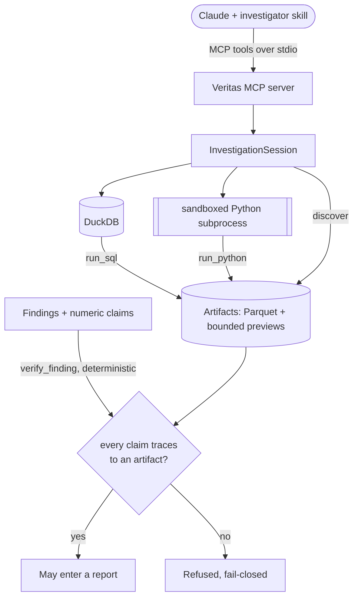

# Veritas

> **Receipts, or it didn't happen.** An open-source MCP server that turns Claude into a
> rigorous, hypothesis-driven data investigator.

> **Status: feature-complete v0.** All milestones M0–M7 are built and green (see the
> [Status](#status) table). Veritas is `0.1.0` (alpha) — the surface is stable enough to use,
> though the API may still change before 1.0.

Veritas is **not a chat wrapper around a database**. It is an investigation harness in which
Claude does the orchestration and deterministic Python does the rigor:

- **Hypothesis-tree investigation.** "Why did revenue drop?" is answered by building a MECE
  hypothesis tree and falsifying branches with targeted queries — not by a one-shot answer.
- **Receipts-or-it-didn't-happen verification.** Every numeric claim in any output must trace
  to an actually executed artifact (SQL/Python result). Enforcement is deterministic Python,
  not an LLM judge.
- **Discovery with suppression.** The autonomous opportunity/risk discovery pass is built as
  generate → test → suppress → rank, with Benjamini–Hochberg false-discovery-rate control,
  effect-size floors, and a hard cap on surfaced findings. Silence is a feature.
- **A public eval suite.** Synthetic datasets with planted root causes and red herrings, scored
  on root-cause recovery rate and false-discovery rate — including a case where the only
  correct answer is "no significant change". Run it with `python -m veritas.evals` (see
  [Evaluation](#evaluation)).

## Status

| Milestone | Scope | State |
| --- | --- | --- |
| M0 | Project scaffold, CI, license, docs skeleton | ✅ done |
| M1 | Ingest (CSV/Parquet/Excel → DuckDB) + profiling | ✅ done |
| M2 | SQL/Python execution sandbox + artifact store | ✅ done |
| M3 | Findings registry + deterministic claim verification | ✅ done |
| M4 | Discovery probes + FDR suppression | ✅ done |
| M5 | MCP server wiring (stdio), `uvx` entry point | ✅ done |
| M6 | Eval suite with planted-cause cases + scorecard | ✅ done |
| M7 | Skills, examples, finished docs | ✅ done |

## Quickstart

Add Veritas to your MCP client (Claude Desktop / Claude Code). It runs over stdio via the
`veritas` console script:

```jsonc
{
  "mcpServers": {
    "veritas": {
      "command": "uvx",
      "args": ["veritas-mcp"]
    }
  }
}
```

From a local checkout instead:

```sh
uv run veritas   # serves over stdio
```

The server exposes nine tools that drive one investigation: `ingest_dataset`,
`profile_dataset`, `run_sql`, `run_python`, `discover`, `record_finding`,
`verify_finding`, `get_artifact`, and `investigation_state`. The intended loop is
load → profile → query → discover → make a claim → **verify** → report: every number a
report makes must cite the artifact it came from, and `verify_finding` re-checks that
citation in deterministic Python.

Each launch is a fresh, single-analyst investigation. Override the session's parent
directory with `VERITAS_SESSION_DIR` and the server's display name with
`VERITAS_SERVER_NAME`.

## Methodology

The tools are only half of Veritas; the other half is the discipline that uses them. That
methodology — build a hypothesis tree, falsify branches with queries, and report only
numbers that trace to a verified execution — ships two ways:

- **In-protocol**, as the MCP prompt `investigation_methodology`, so any client that
  connects to the server receives it.
- **As an installable skill** for Claude Code / the Agent SDK:
  [`skills/veritas-investigator/SKILL.md`](skills/veritas-investigator/SKILL.md).

Both are the same text (a test keeps them identical). See
[a worked investigation](docs/example-investigation.md) for the loop end to end, including
how the receipts rule refuses an untraceable number.

## Architecture

Claude — guided by the investigator skill — orchestrates; deterministic Python does the
rigor. Everything an execution produces is persisted as an `Artifact`, and only findings
whose every number traces to one can enter a report.



The boundaries that make this safe — the read-only SQL gate, the containment model of the
Python sandbox, and the treatment of all dataset text as untrusted — are documented in
[SECURITY.md](SECURITY.md) and the [decision log](DECISIONS.md).

## Evaluation

The eval suite scores the part of Veritas that is deterministic and reproducible — the
statistical engine, not Claude's orchestration. Five seeded synthetic datasets are run
through the real pipeline (ingest → discovery with full suppression), and the surfaced
discoveries are compared to the planted root causes:

```sh
python -m veritas.evals
```

Each case plants a distinct kind of signal — a numeric driver, a group shift, a
categorical association — beside red herrings; one case plants a real cause next to a
statistically significant but trivially small "trap" that the effect-size floor must reject,
and one case plants nothing at all, so the only correct answer is silence. The scorecard
reports two numbers, the **root-cause recovery rate** and the **false-discovery rate**.
Because the signals are strong and the seeds are fixed, the suite demands perfection — every
planted cause recovered, nothing spurious surfaced — so it acts as a regression guard:
anything that lets noise leak through suppression, or drops a real cause, fails it loudly.

## Non-goals

Veritas deliberately does **not** do:

- **Forecasting or ML models** — no predictive models, no SHAP/explainability.
- **Database / warehouse connectors** — analysis is DuckDB over local CSV/Parquet/Excel files.
  Warehouse support is a possible future milestone, not a v0 feature.
- **A web UI** — Veritas is an MCP server; the client is Claude.
- **Multi-user features** — single-analyst, local-first.

## Development

```sh
uv sync          # install runtime + dev dependencies
make check       # ruff format check + lint + mypy strict + pytest with coverage
```

See [DECISIONS.md](DECISIONS.md) for the decision log and [SECURITY.md](SECURITY.md) for the
threat model.

## License

[Apache-2.0](LICENSE)
